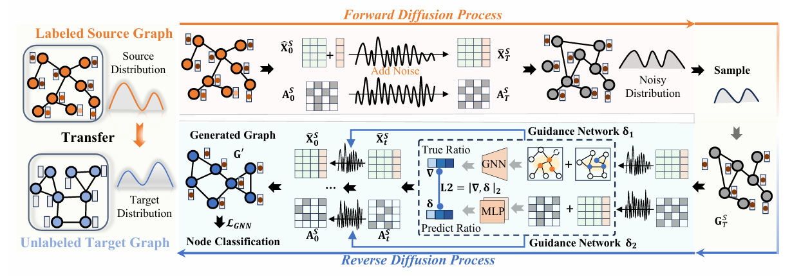

# Learning Structure-Semantic  Evolution Trajectories for Graph Domain Adaptation
This repo is for source code of 2026 ICLR paper "Learning Structure-Semantic  Evolution Trajectories for Graph Domain Adaptation".

# Abstract

Unsupervised Graph Domain Adaptation (UGDA) aims to bridge distribution shifts between domains by transferring knowledge from well-labeled source graphs to given unlabeled target graphs.
Existing methods for UGDA can be broadly categorized into model-oriented and data-oriented approaches. Model-oriented methods typically rely on a unified parameter framework to align domain-invariant representations, but this limits their effectiveness under large structural shifts. Data-oriented methods, on the other hand, model graph transfer as a discrete process by constructing intermediate graphs or alignment steps.
However, this discretization often fails in real-world scenarios, where graph structures evolve continuously and nonlinearly, making it difficult for fixed-step alignment to approximate the actual transformation process.
To address these limitations, we propose DCT, a diffusion-based UGDA method that models cross-graph adaptation as a continuous-time generative process. We formulate the evolution from source to target graphs using stochastic differential equations (SDEs), enabling the joint modeling of structural and semantic transitions. To guide this evolution, we introduce a domain-aware guidance network that estimates the density ratio between source and target graphs in a shared structure–semantic space.  Extensive experiments across 14 transfer tasks demonstrate that DCT consistently outperforms state-of-the-art baselines.

# Model Architecture



# Requirements

This code requires the following:
* torch==2.4.1
* torch-scatter==2.1.2
* torch-sparse==0.6.18
* torch-cluster==1.6.3
* torch-geometric==2.6.1
* numpy==1.26.4
* pygda==1.2.0
* scikit-learn==1.6.1

# Dataset
* **Airport**: It has 3 different domains, i.e., Brazil, Euroup and USA. They can be
  downloaded [here](https://drive.google.com/drive/folders/1zlluWoeukD33ZxwaTRQi3jCdD0qC-I2j?usp=share_link). The graph
  processing can be found at ``AirportDataset``. We utilize ``OneHotDegree`` to construct node features for each node.
* **Blog**: It has 2 different domains, i.e., Blog1 and Blog2. They can be
  downloaded [here](https://drive.google.com/drive/folders/1jKKG0o7rEY-BaVEjBhuGijzwwhU0M-pQ?usp=share_link). The graph
  processing can be found at ``BlogDataset``.
* **Citation**: It has 3 different domains, i.e., ACMv9 , Citationv1 and DBLPv7. They can be
  downloaded [here](https://drive.google.com/drive/folders/1ntNt3qHE4p9Us8Re9tZDaB-tdtqwV8AX?usp=share_link). The graph
  processing can be found at ``CitationDataset``.

# Training: How to run the code

```python
python train.py --source <source dataset> --target <target dataset> --config <config filename>
```

# Evaluate

The `eval_micro_f1` method from the `pygda` library can easily be used to evaluate the performance of the model.

```python
logits, labels = model.predict(target_data)
preds = logits.argmax(dim=1)
mi_f1 = eval_micro_f1(labels, preds)
ma_f1 = eval_macro_f1(labels, preds)
print('micro-f1: ' + str(mi_f1))
print('macro-f1: ' + str(ma_f1))
```

# About Diffusion Models

This is the ICML-2022 paper "[Score-based Generative Modeling of Graphs via the System of Stochastic Differential Equations](https://arxiv.org/abs/2202.02514)".

Our Diffusion Models made modifications based on this code: https://github.com/harryjo97/GDSS.
